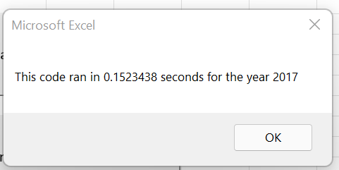
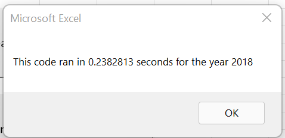

# Stock Analysis using VBA (Microsoft Excel)

 
## **Overview of Project**

The Stocks Analysis project looks at performance of companies based on their stocks in the past couple of years. I summed up the total volume of each company and calculated the percent difference of their starting and ending price. The purpose of the project was to refactor the code we built in Module 2 to be able to analyze stocks data in a faster way.

## **Results**
Results: Using images and examples of your code, compare the stock performance between 2017 and 2018, as well as the execution times of the original script and the refactored script.

**Stock performance:** 
In 2017, SPWR had the highest total volume with 782M and FSLR having the second highest total volume with 684M. The bottom performers in terms of volume were HASI and DQ with volumes of 35M and 82M, relatively. In 2018, ENPH and SPWR having the highest total volume with 607M and 538M, respectively. When comparing between the two years, the total volume is more spread out across the companies in 2018 than in 2017. 

When looking at performance based on returns, in 2017, majority of the stocks saw positive returns with only TERP seeing a negative return of -7.2%. The market did take a turn in the next year after for most companies saw negative returns with only two, ENPH and RUN. 

**Runtime performance:**
Refactoring the code decreased the runtime of the program. The first iteration of the code had a runtime of more than 1 second but with this refactor, the runtime was cut down to ~0.2 seconds (the images below show the runtime of the program coming out the refactor). 

The refactor had the output variables as arrays and a variable to use to index the counter's position, which made the program run faster. The code below is the example where I created the output arrays. 
>    tickerIndex = 0
> '1b) Create three output arrays
>   Dim tickerVolumes(12) As Long
>   Dim tickerStartingPrices(12) As Single
>   Dim tickerEndingPrices(12) As Single

## **Summary**
Summary: In a summary statement, address the following questions.
What are the advantages or disadvantages of refactoring code?
How do these pros and cons apply to refactoring the original VBA script?

